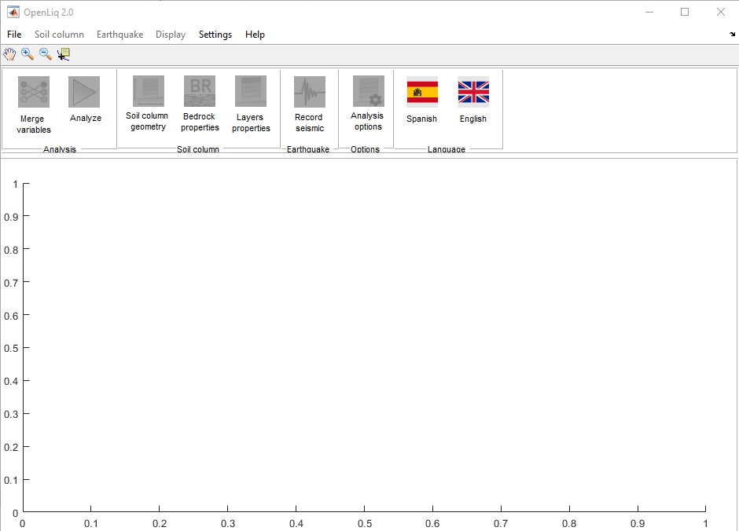
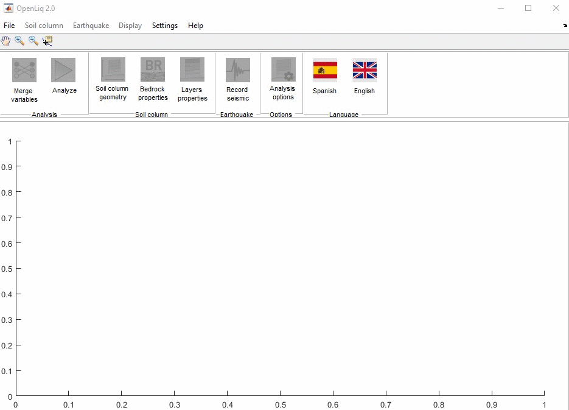
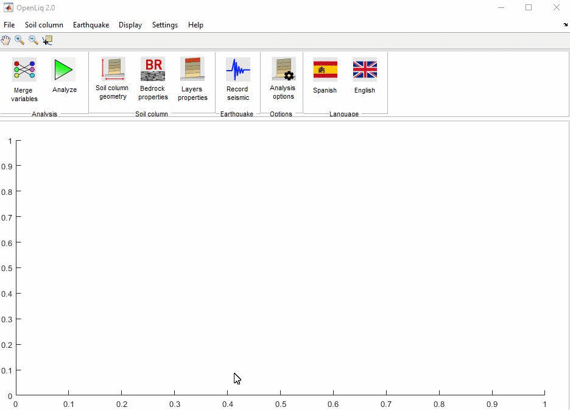
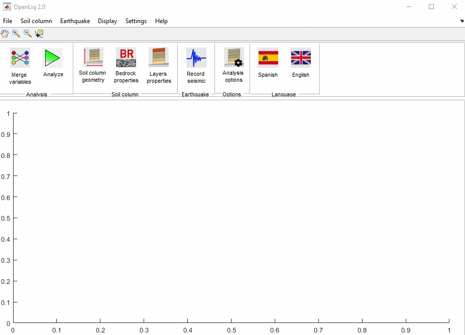
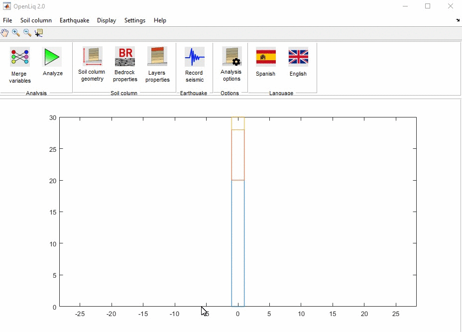

## Quick use of LiqNumeric

#### 01. Open LiqNumeric
Locate the program shortcut and open the program. 

#### 02.  Load example
In the top menu click on **File**, then click on **Examples**, locate the file **OpenLiqProj.mat** and click on **Open**.

#### 03. Merge variables
Click on the button **Merge variables** !

#### 04. Execute analysis
Click on the Analyze button and wait for the analysis configured in the example model to finish.

#### 05. Review results
Click **Display** and select the type of plots to review. 

#### 06. Save analysis results
Go to the top menu, click **Display**, then click **Results**, select **All columns** or **Select column**, indicate the place to save and type the name of the file containing the results.

