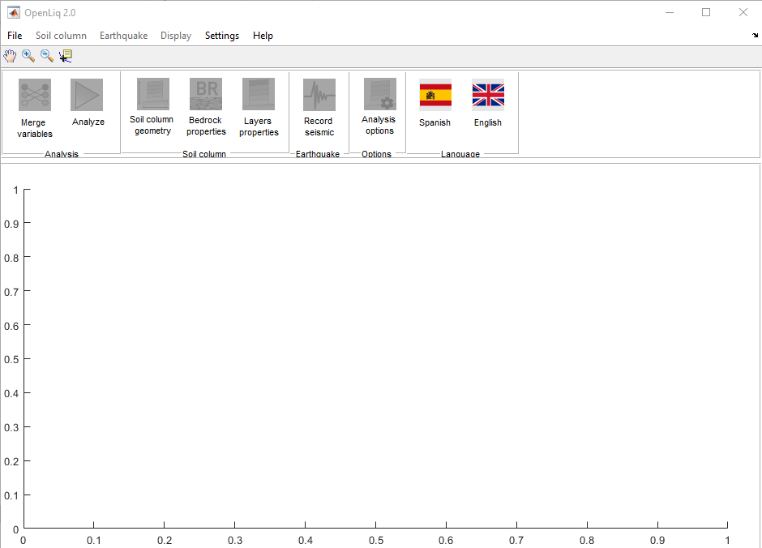
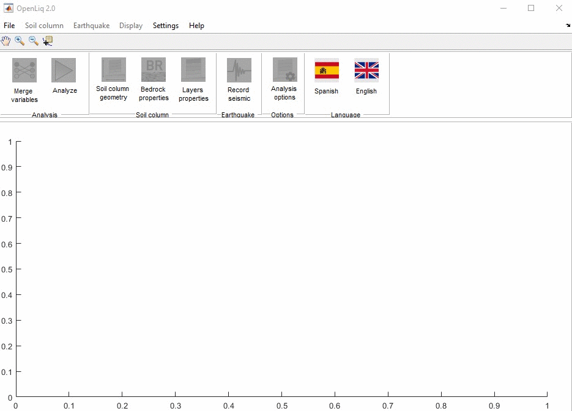

## Uso rápido de LiqNumeric

#### 01. Abrir LiqNumeric
Ubique el acceso directo del programa y abra el programa. 

#### 02.  Cargar ejemplo
En el menú superior de clic en **File**, luego de clic en **Examples**, ubique el archivo **OpenLiqProj.mat** y de clic en **Abrir**

#### 03. Permutar variables
De clic en el botón **Merge variables**

#### 04. Ejecutar análisis
De clic en el botón de análiza y espere que termine el análisis configurado en el modelo de ejemplo.

#### 05. Revisar resultados
De clic en **Display** y seleccione el tipo de gráficas a revisar. 

#### 06. Guardar resultados de análisis
Vaya al menú superior, de clic en **Display**, luego clic en **Results**, seleccione  **All columns** o **Select column**, indique el sitio donde almacenar y escriba el nombre del archivo que contiene los resultados.

